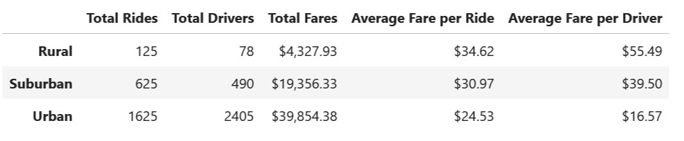
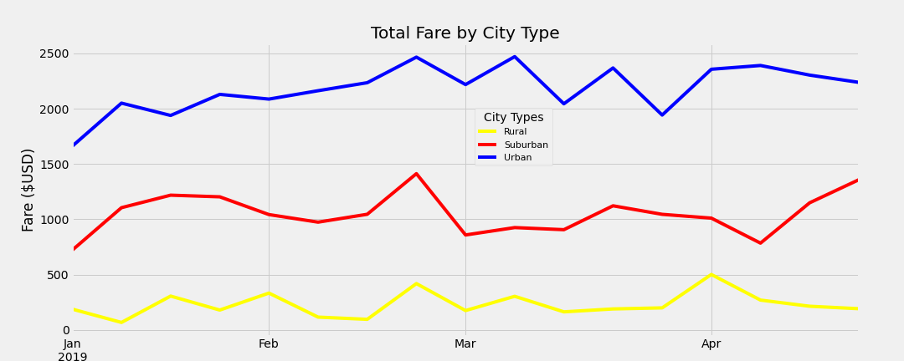

# Regional Ride Share Fare Analysis 

## Overview of Project

### Purpose
-To evaluate a set of ride-sharing data, create a DataFrame that summarizes data by city type, and create a line graph that demonstrates weekly fares per city type.

## Results

## Summary
As we observe and analyze the ride share data we can focus on three takeaways which will follow the order of the three graphs above. 
1.	There should a consideration and possible further analysis when contemplating a driver to ride ratio in each region. We can see that that when the ratio favors drivers(e.g. Urban region) the cost of the trips is much less. Cost go up for every one when this ratio leans towards the rides given. 
2.	The obvious area with the most trips shared is in the urban regions. This area will demand the most resources and have the most demand.
3.	Urban areas will generate more income overall, but advertising for the app in less populated areas may help reduce the fares and improve the driver to ride ratio. 

